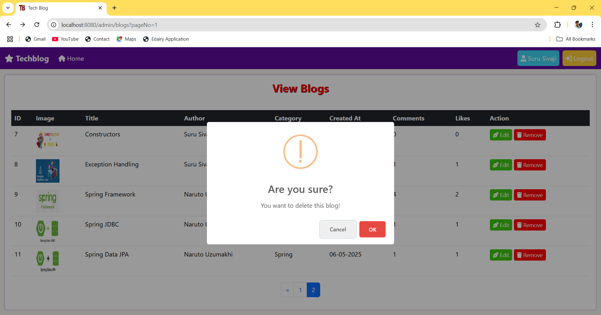
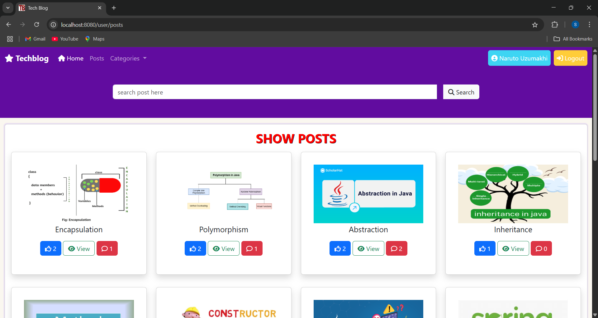

<h1 align="center">📝 Tech Blog Application</h1>

<p align="center">
  A feature-rich, role-based blogging platform built with <strong>Spring MVC</strong>, <strong>Spring Boot</strong>, <strong>Spring Data JPA</strong>, <strong>MySQL</strong>, <strong>HTML</strong>, <strong>CSS</strong>, and <strong>Bootstrap</strong>.
</p>

<p align="center">
  
  
  
  
  
  
  
</p>

---

## 🚀 Overview

The **Tech Blog Application** is a comprehensive web-based blogging platform designed to empower both **Admins** and **Users** with distinct roles and capabilities. The primary purpose of this project is to provide a secure, scalable, and user-friendly environment where content can be created, managed, and consumed efficiently. Admins have the authority to oversee the entire system by managing blog categories, creating and editing blog posts, controlling user registrations, and moderating comments and likes to maintain quality and relevancy. Users, on the other hand, can register themselves, log in securely, explore a wide range of blogs, engage with content by liking and commenting, and manage their personal profiles.


---

## ✨ Features

- Role-based access for **Admins** and **Users**  
- Admins can manage categories, blogs, users, admins, comments, and likes  
- Users can register, login, view blogs, like, comment, and update their profile  
- Session management for secure, personalized experience  
- Pagination for efficient and user-friendly content browsing  
- Clean and responsive UI built with Bootstrap  
- Layered architecture for maintainability and scalability  

---

## 🛠️ Tech Stack

- ⚙️ **Backend:** Java, Spring MVC, Spring Boot, Spring Data JPA  
- 🗃️ **Database:** MySQL  
- 🎨 **Frontend:** HTML, CSS, Bootstrap  
- 🔧 **Build Tool:** Maven  
- 💻 **IDE:** IntelliJ IDEA / Eclipse  

---

## 📁 Layered Architecture

- 🧱 **Model Layer:** Contains entity classes mapped to database tables  
- 📂 **Repository Layer:** Interfaces for DB operations using Spring Data JPA  
- 🔧 **Service Layer:** Contains business logic  
- 🕹️ **Controller Layer:** Handles HTTP requests and responses  
- 🎨 **UI Layer:** Built with HTML and Bootstrap (with session & pagination support)  

---

## 📌 How the Project Works

1. **Application Startup**  
   The Spring Boot server starts and connects to the MySQL database. Tables are created automatically based on JPA entity classes.

2. **Admin Login**  
   Admin logs in with secure credentials. A session is established to maintain state across pages.

3. **Admin Actions**  
   Admins can add, update, delete, and view categories and blogs. They can manage users and other admins, moderate comments and likes, and update their own profile.

4. **User Registration & Login**  
   New users register through a sign-up form. On successful login, a session is created for personalized access.

5. **User Actions**  
   Users can browse all blogs, like posts, add comments, and update their profiles.

6. **Session Management**  
   Sessions store user/admin data for authentication and personalized UI rendering.

7. **Pagination**  
   Blog listings use pagination to improve load times and user experience by breaking content into manageable pages.

---

## 👥 Roles & Features

### 👑 Admin

#### 🔐 Authentication
- Secure login with registered admin credentials.

#### 📂 Category Management
- Add, update, delete, and view blog categories.

#### 📝 Blog Management
- Create, update, delete, and view blogs (all and own).

#### 👤 Admin Profile
- View and update admin profile details.

#### 👥 Admin Management
- Add, delete, and view all admins.

#### 👨‍💼 User Management
- Add, update, delete, and view users.

#### 💬 Comment Management
- View and delete comments.

#### ❤️ Like Management
- View and delete likes.

---

### 🙋‍♂️ User

#### 📝 Authentication
- Register and login securely.

#### 📖 Blog Interaction
- View all blogs, like posts, comment on blogs.

#### 👤 Profile Management
- View and update own profile.

---
## 🛠️ Setup & Installation

### 📋 Prerequisites
- ☕ **Java Development Kit (JDK) 8+**
- ⚙️ **Spring Boot Framework**
- 🗄️ **MySQL Database**
- 🛠️ **Maven**
- 💻 **Spring Tool Suite (STS)**

### ⚙️ Steps to Run the Application

#### 1️⃣ Clone the Repository
```sh
git clone https://github.com/your-username/shopping-application.git
cd shopping-application
```

#### 2️⃣ Configure Database (MySQL)
- Create a database in MySQL:
  ```sql
  CREATE DATABASE shopping_app;
  ```
- Update `application.properties` with MySQL credentials:
  ```properties
  spring.datasource.url=jdbc:mysql://localhost:3306/shopping_app
  spring.datasource.username=root
  spring.datasource.password=yourpassword
  spring.jpa.hibernate.ddl-auto=update
  ```

#### 3️⃣ Build the Project Using Maven
```sh
mvn clean install
```

#### 4️⃣ Run the Spring Boot Application
```sh
mvn spring-boot:run
```

#### 5️⃣ Access the Application
- **User Panel:** `http://localhost:8080/`
- **Admin Panel:** `http://localhost:8080/admin`

---

  ## 🖼️ Screenshots
<p>Below are sample screenshots showcasing the Tech blog Application:</p>
<div>
  <h4>1. Index Page</h4>
  
   <h4>2. Admin Login Page</h4>
  
   <h4>3. Admin Dashboard Page</h4>
  
   <h4>4. Admin Profile Page</h4>
  
  <h4>5. Edit Admin Profile Page</h4>
  
  <h4>6. Delete Admin Account Page</h4>
  
   <h4>7. Add Blog Page</h4>
  
   <h4>8. Categories Page</h4>
  
   <h4>9. Edit Category Page</h4>
  
   <h4>10. Delete Category Page</h4>
  
  <h4>11. View Blogs Page</h4>
  
  <h4>12. Edit Blog Page </h4>
  
  <h4>13. Delete Blog Page</h4>
  
  <h4>14. Users Information Page</h4>
  
  <h4>15. Edit User Page</h4>
  
  <h4>16. Delete User Page</h4>
  
  <h4>17. Add Admin Page</h4>
  
  <h4>18. View Admins Page</h4>
  
  <h4>19. Edit Admin Information Page</h4>
  
  <h4>20. Delete Admin Information Page</h4>
  
  <h4>21. Comments Page</h4>
  
  <h4>22. Delete Comment Page</h4>
  
  <h4>23. Likes Page</h4>
  
  <h4>24. Delete Like Page</h4>
  
  <h4>25. Admin Posts Page</h4>
  
  <h4>26. Admin Logout Page</h4>
  
  <h4>27. User Registration Page</h4>
  
  <h4>28. User Login Page</h4>
  
  <h4>29. User Home Page</h4>
  
  <h4>30. User Profile Page</h4>
  
  <h4>31. Edit User Profile</h4>
  
  <h4>32. Posts Page</h4>
  
  <h4>33. Read Post Page</h4>
  
  <h4>34. Leave Comment And Like</h4>
  
  <h4>35. Search Post Page</h4>
  
  <h4>36. User Logout Page</h4>
  
---

---

## 🎉 **Thank You for Using My Application!** 🎉

<p align="center">
  
  
  
</p>

Thank you for using my application.  
Enjoy learning awesome technologies like this, and keep building great things! 🚀
